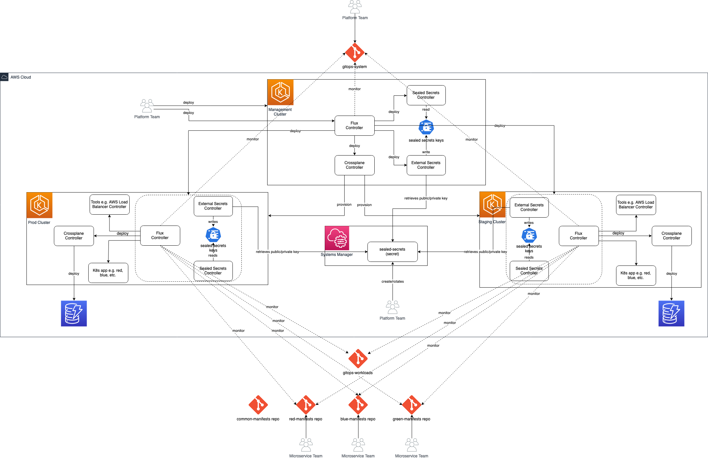

# Build Multi-Cluster GitOps system using Amazon EKS, Flux CD, and Crossplane
## Introduction

Many organizations are interested in adopting GitOps for the benefits it brings, including increased productivity, enhanced developer experience, improved stability, higher reliability, consistency and standardization, and stronger security guarantees (see [Key Benefits of GitOps](https://www.weave.works/technologies/gitops/#key-benefits-of-gitops)).

In many cases, organizations use GitOps with Amazon Elastic Kubernetes Service (Amazon EKS) clusters to run stateless application components, and then rely on cloud infrastructure resources sitting outside the EKS clusters to maintain state. These might include databases (such as Amazon RDS, Amazon DynamoDB), messaging systems (such as Amazon SQS), and blob storage (Amazon S3) amongst others. Organizations can benefit from extending the use of GitOps to cover these cloud infrastructure resources as well.

Additionally, organizations often need more than just one EKS cluster. For example, they may require multiple environments to support their SDLC (e.g. production, development, QA, staging, etc.), and to comply with governance rules related to division of responsibilities (e.g. providing each of the organization’s departments with a dedicated set of clusters). This raises the need for a scalable cluster management solution, which cannot be achieved by having a central platform team assuming sole ownership for provisioning, bootstrapping, and managing the organization’s cluster fleet.

A decentralized (self-service) model for cluster management, accompanied by the right governance structures, can be adopted to achieve the desired scalability. In this model, a platform team leverages GitOps to allow application teams to provision and bootstrap clusters themselves. An application team member creates a pull request with the specifications of cluster. The pull request can either go through a list of pre-defined checks and get automatically approved/merged, or it can go to a platform team member who manually review/approves it, then merges it. Once merged, the cluster is automatically provisioned and bootstrapped with the required tooling, as per the specific standards of the organization. After provisioning and the bootstrapping the cluster, application teams can use it for running their applications.

This repo contains the implementation of a multi-cluster GitOps system that addresses the application development teams use cases, as well as the platform teams use cases. It shows how to extend GitOps to cover the deployment and the management of cloud infrastructure resources (e.g. Amazon RDS, Amazon DynamoDB, and Amazon SQS), in addition to the deployment and management of the native Kubernetes resources. It also shows how to use GitOps to perform cluster management activities (e.g. provisioning and bootstrapping a new cluster, upgrading an existing cluster, deleting a cluster, etc.).

## Architecture
A hub/spoke model is used to implement the multi-cluster GitOps. As part of the initial setup, an EKS cluster — the management cluster — is manually created using eksctl, and bootstrapped. Then, the other EKS clusters — workload clusters — are created dynamically by the management cluster using GitOps. The clusters bootstrapping and the deployment of various tools and controllers are also performed using GitOps.

This solution uses FluxCD as a GitOps tool, and uses Crossplane as an infrastructure controller. It also uses Sealed Secrets and External Secrets Operator for secrets management — more details about that exist in the following sections.

The architecture of the solution is depicted in the following diagram:

At a high level, the initial setup of the solution involves:
  * Setting up the Git repos required for the solution.
  * Generating the keys that will be used by Sealed Secrets for encrypting the secret information stored in Git and decypting it before applying to the target cluster. The generated key are stored in AWS Secrets Manager. External Secrets Operator is used for retrieving the keys from AWS Secrets Manager and injecting it into the target cluster.
  * Creating a dedicated IAM role for the Crossplane AWS provider to be installed in the management cluster.
  * Creating the management cluster, and bootstrapping it with Flux.
  * Setting up a `ConfigMap` in `flux-system` namespace named `cluster-info` and populating it with the management cluster details. This `ConfigMap` definition allows dynamic variable substitutions through Flux Kustomization `spec.postBuild.substituteFrom` action.

After the initial setup, the Flux controller in the management cluster deploys other controllers that are required in the management cluster — this includes Crossplane, External Secrets Operator, and Sealed Secrets. The Flux controller synchronizes the workload clusters definitions that exist in Git into the management clusters. Then, Crossplane picks up these definitions, and creates the workload clusters. The Flux controller on the management cluster is also responsible for bootstrapping the provisioned workload cluster with its own Flux controller, and the pre-requisites for that.

The Flux controller on each of the workload clusters deploys other tools required on the cluster (e.g. Crossplane, AWS Load Balancer Controller, etc.), and the workloads (applications, microservices, ...) meant to be deployed on the cluster, as defined in Git. The workloads typically consist of standard Kubernetes resources (e.g. Deployment, Service, ConfigMap, Secret, etc.), and cloud infrastructure resources as well (e.g. DynamoDB table, SQS queue, RDS instance, etc.) that are required for the workload to fully function.

One of the architectural decisions made is to deploy a separate Flux and Crossplane controller on each of the workload clusters, rather than having a central Flux and Crossplane controllers in the management clusters that server all the clusters. The key reason behind that is to reduce dependency on the management cluster, and to increase the scalability of the solution — single/central set of controllers in the management cluster would lead to less scalable solution, compared to separate set of controllers per cluster.

**Note:**
The API server endpoint public access is enabled for the management cluster and the workload clusters provisioned by this management cluster. Support for private clusters is on our roadmap.

### Git Repositories
The table below lists the proposed repos:

Local Path | Git Repo Name | Owner | Description |
--- | --- | --- | --- |
| `gitops-system` | `gitops-system` | Platform team | This repo contains the manifests for all workload clusters, the manifests for the tools installed on the clusters. It also contains the directories that are synced by the Flux controller of each cluster. While this repo is owned by the platform team, application teams may raise pull requests for new clusters they want to create, or changes on existing cluster they want to implement. Platform team reviews and merges pull requests. See the [README][gitops-system-readme] for more detailed information about its contents. |
| `app-manifests/product-catalog-api-manifests` | `product-catalog-api-manifests` | Application Team | This represents the repo for the backend API  of an imaginary product catalog application. It contains a Kustomization and overlays for the API application resources and the cloud infrastructure resources. |
| `app-manifests/product-catalog-fe-manifests` | `product-catalog-fe-manifests` | Application Team | This represents the repo for the frontend of an imaginary product catalog application. It contains a Kustomization and overlays for the frontend application resources. |
| `gitops-workloads` | `gitops-workloads` | Governance team | This repo connects the repos above — it specifies which applications are deployed on which clusters i.e. for deploying a new application or microservice into a cluster, you go to the folder corresponding to the cluster, and add the manifests required for having a Flux Kustomization that syncs the application repo to the target cluster. This repo may be owned by a central governance team, where application teams raise a pull request for deploying their application to a cluster, and the central governance team reviews and merges the pull request. Also, organizations may choose to reduce governance overhead, and keep this repo open for application teams to directly commit into it the manifests required for deploying their application into a cluster. In that case, it is important to deploy and enable the cluster auto scaler on the clusters to automatically scales out and in, based on the workloads deployed into it. |

**Note:**
The `initial-setup` directory is meant for a one-time initialization of the management cluster and does not need to be placed into its own repo. 

[gitops-system-readme]: ./repos/gitops-system/README.md

### Secrets Management
One of the key challenges in GitOps is managing secrets. GitOps entails storing the target state of the system in Git — this covers all the manifests required for describing the target state of the system, including secrets/credentials used for different purposes e.g. username/password used for connecting to a database, or an external service, or even the credentials used by the Flux controller for connecting to Git repos. Such credentials cannot be stored in Git in its plain form, it has to be encrypted. For that purpose, the solution includes Sealed Secrets. The secret information that needs to be deployed into the clusters is first encrypted by the user, and a corresponding SealedSecret resource is created — that is what gets committed into Git. The Sealed Secret controller is then responsible for decrypting the SealedSecret resources deployed via GitOps, and transforming them to a Secret resource, and can be referenced by other resources.

Sealed Secrets itself requires public/private keys that are used for encrypting/decrypting secrets. This can be auto-generated by Sealed Secrets controller at start up time, or predefined using a Secret with specific label. A decision was made to predefine the public/private keys used by Sealed Secrets. Otherwise, it would have been challenging to complete the creation and bootstrapping of new workload clusters using GitOps without manual intervention/customisation. The reason is that bootstrapping the workload cluster involves deploying Flux controller, and the Flux controller requires credentials to be able to connect to Git for synchronization. If the public/key used for encrypting/decrypting the Git credentials are auto generated at deployment time, then the process will have to be split into multiple parts with manual intervention or custom implementation — the first part is the creation of the cluster, and the deployment of Sealed Secrets controller into it. Then, the generated public key needs to be retrieved and used for re-encrypting the Git credentials. The re-encrypted credentials need to be committed into Git. Then, the last part would be deploying the Flux controller.

The pre-defined public/private key pair for Sealed Secrets is created as part of the initial setup, and stored in AWS Secrets Manager. External Secrets Operator is used for retrieving the keys in AWS Secrets Manager, and creating a Secret in the cluster that contains the keys, and has the label required for Sealed Secrets.

This repo contains the configuration of the management cluster and Kubernetes manifests representing the workload clusters, their configuration and the applications running within them. While these are represented as directories within this single repositories, the system assumes that they are split into multiple separate repositories - which allows for finer-grained permissions and version control over each separate part. The directories should be divided into the following repositories:

## IAM roles for service accounts (IRSA)
IAM roles for service accounts (IRSA) configuration varies widely for different tools. It may not be feasible to individually list the configuration steps for each of the tools. This section provides the overall architecture and lists the main configuration steps for key tools like Crossplane and External Secrets Operator.

There are various parts to get IRSA working. The major ones are:
  1. IAM IDP pointing to the EKS cluster OIDC endpoint
  2. IAM policy with permissions for the controller or application
  3. IAM role with trust policy referring to the federated IDP and conditions on JWT `sub` claim referring to the `Namespace` and `ServiceAccount` of the pod
  4. IAM role policy attachment
  5. `ServiceAccount` with annotation referring to the IAM role ARN
  6. Pod manifest referring to the annotated `ServiceAccount`

The management cluster creation process sets up an IAM IDP pointing to the management cluster OIDC endpoint. The first tool to get installed is Crossplane. Once Crossplane is installed it is responsible for setting up IAM objects for the rest of the tools and applications in management cluster and workload clusters including for Crossplane itself installed in the workload clusters. However, the initial IAM setup to get Crossplane configured with IRSA in the management cluster requires setup outside of gitops.

### Enable IRSA for `crossplane/provider-aws`
The `ControllerConfig` object [found here](repos/gitops-system/tools/crossplane/crossplane-aws-provider/aws-provider.yaml) is annotated with the IAM role ARN. You'll notice the placeholder `${ACCOUNT_ID}` will be replaced through Flux `postBuild` substitution. This annotation is implicitly copied into the service account used by the AWS provider controller during init. The `ControllerConfig` defined earlier is referred in the `spec.controllerConfigRef.name` field in the `Provider` object manifest for `crossplane/provider-aws`. The `ProviderConfig` object [found here](repos/gitops-system/tools/crossplane/crossplane-aws-provider-config/aws-providerconfig.yaml) controls the authentication mechanism used by AWS controllers to create the XRs. The `ProviderConfig` uses `InjectedIdentity` as the value for the field `spec.credentials.source`. Refer [this doc](https://github.com/crossplane-contrib/provider-aws/blob/master/AUTHENTICATION.md#using-iam-roles-for-serviceaccounts).

For the workload clusters the IAM objects for Crossplane IRSA are created by the management cluster. The tool itself is installed by Flux running in the workload cluster.

### Enable IRSA for `external-secrets`
The IAM role and policies are created through `crossplane` and can be [found here](repos/gitops-system/tools-config/external-secrets-iam/external-secrets-iam.yaml). The `ServiceAccount` manifest [found here](repos/gitops-system/tools-config/external-secrets/sealed-secrets-key.yaml) uses EKS IRSA annotation to refer to the IAM role ARN. Like earlier here also you'll notice `${ACCOUNT_ID}` placeholder that will be replaced through Flux kustomization `postBuild` substitution. The `ServiceAccount` is used to configure the authentication mechanism for the `SecretStore` [found here](repos/gitops-system/tools-config/external-secrets/sealed-secrets-key.yaml) referring to AWS Secrets Manager using the field `spec.provider.aws.auth.jwt.serviceAccountRef.name`. Refer [this doc](https://external-secrets.io/v0.5.7/provider-aws-secrets-manager/#eks-service-account-credentials).

For the workload clusters the IAM objects and `external-secrets` installation is performed from the management cluster.

## Deployment
Please refer to [the initial setup](./initial-setup) for deploying the system. Also refer to [scenarios](./scenarios.md) for the instructions related to various scenarios (e.g. creating a new workload cluster, deleting a workload cluster, onboarding a new microservice/application and deploying it to one or more of the workload clusters).

Please refer to [Clean-up](./clean-up) for un-deploying the system.

## Security

See [CONTRIBUTING](CONTRIBUTING.md#security-issue-notifications) for more information.

## License

This library is licensed under the MIT-0 License. See the LICENSE file.

