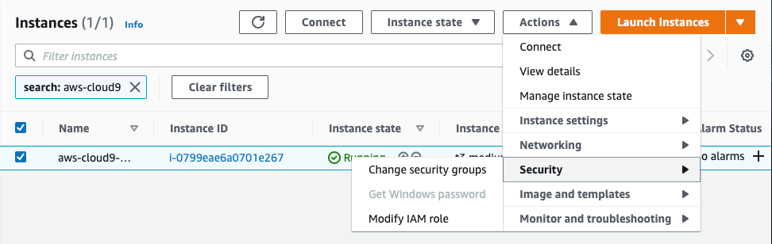

# The initial setup
## Prerequisites

Each cluster you create requires 1 VPC (with an Internet Gateway attached), 2
Public Subnets, 2 Private Subnets, 2 NAT Gateways, and 2 Elastic IP Addresses
(attached to the NAT Gateways). Please make sure that the quotas of the AWS
account you use for deploying this sample implementation can accommodate that.

## Create and prepare the Cloud9 workspace


1. Navigate to the [Cloud9 console](https://console.aws.amazon.com/cloud9/).

2. Create a new Cloud9 environment with the name "gitops", using an EC2 *t2.micro* instance and *Ubuntu 18.04* platform. Leave all other settings as default, and select **Create Environment**.

3. While the Cloud9 environment is being created, create an EC2 IAM role for your workspace instance as follows:
    1. Open another tab to access the [IAM console](https://console.aws.amazon.com/iam/).
    2. From the menu bar on the left, choose **Roles**.
    3. Choose **Create Role**.
    4. For **Trusted entity type** choose **AWS Service**, and then choose the use case **EC2**. Choose **Next**.
    5. On the **Add Permissions** screen, choose **Create policy**. This action opens new tab in your browser for creating an IAM policy.
    6. In the new browser tab, choose **JSON**, paste the content of [cloud9-role-permission-policy-template.json](config/cloud9-role-permission-policy-template.json), replace `${ACCOUNT_ID}` (3 occurrences) with your AWS account id, replace `${AWS_REGION}` (2 occurrence) with the AWS region you are using, choose **Next**, then choose **Next** again. 
    7. Give the policy a name, for example "gitops-workshop", and choose **Create policy**. 
    8. Return to the previous browser tab, click on the refresh button, add the IAM policy you created in the other browser tab, and choose **Next**.
    9. Give the role a name, for example "gitops-workshop", and choose **Create role**. 

4. Attach this IAM role to your Cloud9 EC2 instance as follows:

    1. Switch to the tab running your Cloud9 IDE.

    2. If it has still not finished being created, then wait until creation is complete.
    3. Click the grey circle button (in top right corner) and choose  **Manage EC2 Instance**.  
    4. This opens the EC2 console in a separate tab, with a filter applied to show the EC2 instance for your Cloud9 IDE. Select the instance, then choose **Actions / Security / Modify IAM Role**. 
    5. On the **Modify IAM role** screen, choose *gitops-workshop* from the IAM role dropdown. 
    6. Choose **Update IAM role**.
    7. Close the tab and return to your Cloud9 IDE tab.

5. In a Cloud9 Terminal window, upgrade to the latest AWS CLI using:
   ```
   curl "https://awscli.amazonaws.com/awscli-exe-linux-x86_64.zip" -o "awscliv2.zip"
   unzip awscliv2.zip
   sudo ./aws/install
   ```

6. Disable Cloud9 managed credentials using:
   ```
   aws cloud9 update-environment  --environment-id $C9_PID --managed-credentials-action DISABLE
   rm -vf ${HOME}/.aws/credentials
   ```

7. Verify that Cloud9 is using the *gitops-workshop* IAM role you created.
   ```
   aws sts get-caller-identity --query Arn | grep gitops-workshop -q && echo "IAM role valid" || echo "IAM role NOT valid"
   ```


8. Install `yq`
   ```bash
   sudo curl --silent --location -o /usr/local/bin/yq https://github.com/mikefarah/yq/releases/download/v4.24.5/yq_linux_amd64
   sudo chmod +x /usr/local/bin/yq
   ```
   
9. Track the account ID and region using environment variables,
   and update `.bash_profile` and `~/.aws/config`so that these veriables will be available in all Cloud9 Terminal windows.
   ```
   export ACCOUNT_ID=$(aws sts get-caller-identity --output text --query Account)
   export AWS_REGION=$(curl -s 169.254.169.254/latest/dynamic/instance-identity/document | yq -e '.region')
   echo $ACCOUNT_ID:$AWS_REGION
   echo "export ACCOUNT_ID=${ACCOUNT_ID}" | tee -a ~/.bash_profile
   echo "export AWS_REGION=${AWS_REGION}" | tee -a ~/.bash_profile
   aws configure set default.region ${AWS_REGION}
   aws configure get default.region
   ```

10. Track the ARN of the IAM entity that is used for accessing the EKS console using environment variables.

(Replace `<IAM user/role ARN>` in the command below with the ARN of the IAM user or role used for accessing the EKS console).

   ```bash
   export EKS_CONSOLE_IAM_ENTITY_ARN=<IAM user/role ARN>
   echo "export EKS_CONSOLE_IAM_ENTITY_ARN=${EKS_CONSOLE_IAM_ENTITY_ARN}" | tee -a ~/.bash_profile
   ```

11. Increase the volume of the EBS volume to 30GB as follows.
    1. Copy the [volume resize script from the Cloud9 documentation](https://docs.aws.amazon.com/cloud9/latest/user-guide/move-environment.html#move-environment-resize) into a file `resize.sh` in your Cloud9 environment.
    2. Run 
       ```
       bash resize.sh 30
       ```


## Install tools and workshop files

Having set up your Cloud9 environment, you can now install a number of tools that will be used to build the multi-cluster GitOps environment.

1. Install Kubernetes CLI (`kubectl`)
   ```bash
   sudo curl --silent --location -o /usr/local/bin/kubectl \
      https://s3.us-west-2.amazonaws.com/amazon-eks/1.24.7/2022-10-31/bin/linux/amd64/kubectl

   sudo chmod +x /usr/local/bin/kubectl
   ```

2. Install Flux CLI
   ```bash
   curl -s https://fluxcd.io/install.sh | sudo bash
   ```

3. Install `kubeseal`
   ```bash
   wget https://github.com/bitnami-labs/sealed-secrets/releases/download/v0.19.0/kubeseal-0.19.0-darwin-amd64.tar.gz
   tar xfz kubeseal-0.19.0-darwin-amd64.tar.gz
   sudo install -m 755 kubeseal /usr/local/bin/kubeseal
   ```

4. Install the Github CLI
   ```bash
   curl -fsSL https://cli.github.com/packages/githubcli-archive-keyring.gpg | sudo dd of=/usr/share/keyrings/githubcli-archive-keyring.gpg
   echo "deb [arch=$(dpkg --print-architecture) signed-by=/usr/share/keyrings/githubcli-archive-keyring.gpg] https://cli.github.com/packages stable main" | sudo tee /etc/apt/sources.list.d/github-cli.list > /dev/null
   sudo apt update
   sudo apt install gh
   ```

5. Install `eksctl`
   ```bash
   curl --silent --location "https://github.com/weaveworks/eksctl/releases/latest/download/eksctl_$(uname -s)_amd64.tar.gz" | tar xz -C /tmp
   sudo mv /tmp/eksctl /usr/local/bin
   ```
     
6. Clone the workshop git repo:
   ```
   cd ~/environment
   git clone https://github.com/aws-samples/multi-cluster-gitops.git
   ```
   
## Create a secret in AWS Secret Manager for Sealed Secrets keys

1. Generate a 4096-bit RSA key pair using *openssl*:
   ```bash
   cd ~/environment
   openssl genrsa -out sealed-secrets-keypair.pem 4096
   openssl req -new -x509 -key sealed-secrets-keypair.pem -out sealed-secrets-keypair-public.pem -days 3650
   ```
   Enter appropriate values (or accept defaults) for the various fields. 
2. Create a JSON document that contains the certificate and the private key as follows:
   ```
   CRT=$(cat sealed-secrets-keypair-public.pem)
   KEY=$(cat sealed-secrets-keypair.pem)
   cat <<EoF >secret.json
   {
     "crt": "$CRT",
     "key": "$KEY"
   }
   EoF
   ```
3. Store this JSON document as a `sealed-secrets` secret in the AWS Secrets Manager:
   ```
   aws secretsmanager create-secret \
     --name sealed-secrets \
     --secret-string file://secret.json
   ```

## Create the management cluster

Create the management cluster using `eksctl`
```bash
cd ~/environment
cp multi-cluster-gitops/initial-setup/config/mgmt-cluster-eksctl.yaml .
sed -i "s/AWS_REGION/$AWS_REGION/g" mgmt-cluster-eksctl.yaml     
eksctl create cluster -f mgmt-cluster-eksctl.yaml
```
This will take some time. You can proceed to the next section in parallel, using a separate terminal window.

## Create the Git repositories

You can use GitHub or AWS CodeCommit as the backend for your Git repositories.

[Using GitHub as `GitRepository` backend.](doc/repos/GitHub.md#create-and-prepare-the-git-repositories)

OR

[Using AWS CodeCommit as `GitRepository` backend.](doc/repos/AWSCodeCommit.md#create-and-prepare-the-git-repositories)


## Populate and update the repositories
   
To populate the repos you created, copy the content of the
`multi-cluster-gitops/repos` directories to the corresponding repos you
created in the previous step:
```
cp -r multi-cluster-gitops/repos/gitops-system/* gitops-system/
cp -r multi-cluster-gitops/repos/gitops-workloads/* gitops-workloads/
```
Some of the files in these repos contain placholder references for `AWS_REGION`, `REPO_PREFIX`, and `EKS_CONSOLE_IAM_ENTITY_ARN` which need to be updated to reflect your working region, the location of your repos, and the ARN of the IAM entity that is used for accessing the EKS console.

### Update references to AWS region

Run the `sed` comand below to update various manifests to point to the correct AWS region:
```
sed -i "s/AWS_REGION/$AWS_REGION/g" \
   gitops-system/clusters-config/template/def/eks-cluster.yaml \
   gitops-system/tools-config/external-secrets/sealed-secrets-key.yaml
```


### Update references to GitRepository URLs

1. Verify that REPO_PREFIX is set correctly (for either GitHib or CodeCommit)
   ```
   echo $REPO_PREFIX
   ```

2. Update the `git-repo.yaml` files in the `workloads` folder of the `gitops-system` repo,
   updating the `url` for the `GitRepository` resource to point at 
   the `gitpops-workloads` repo created in your account:
   ```
   sed -i "s~REPO_PREFIX~$REPO_PREFIX~g" \
     gitops-system/workloads/template/git-repo.yaml
   ```
3. Update the `gotk-sync.yaml` files in the `clusters` folder of the `gitops-system` repo,
   updating the `url` for the `GitRepository` resource to point at the `gitpops-system` repo created in your account:
   ```
   sed -i "s~REPO_PREFIX~$REPO_PREFIX~g" \
     gitops-system/clusters/mgmt/flux-system/gotk-sync.yaml \
     gitops-system/clusters/template/flux-system/gotk-sync.yaml
   ```

4. Update the `git-repo.yaml` files in the `gitops-workloads` repo,
   updating the `url` for the `GitRepository` resource to point at the `payment-app-manifests` repo created in your account:
   ```
   sed -i "s~REPO_PREFIX~$REPO_PREFIX~g" \
     gitops-workloads/template/app-template/git-repo.yaml
   ```

### Patch `GitRepository` for AWS CodeCommit

*Note*: Please execute this section only if you are using AWS CodeCommit as the `GitRepository` backend.
The default `go-git` client used by `GitRepositoryReconciler` does not support
[version 2 of Git's wire protocol](https://git-scm.com/docs/protocol-v2). AWS CodeCommit git servers only support the newer
v2 protocol. In this section we will set the git client implementation to `libgit2`. Please refer to
[Git implementation](https://fluxcd.io/docs/components/source/gitrepositories/#git-implementation) section for the
feature matrix of the supported git client implementations.

1. Export environment variable with the `yq` expression to use to patch the `GitRepository` resources

   ```bash
   LIBGIT2='. |= (with(select(.kind=="GitRepository");.spec |= ({"gitImplementation":"libgit2"}) + .))'
   ```

2. Patch the `git-repo.yaml` files in the `workloads` folder of the `gitops-system` repo,
   adding the `spec.gitImplementation` node for the `GitRepository` resource
   to force the use of `libgit2` as the git client to connect to the repo:
   ```bash
   yq -i e "$LIBGIT2" \
     gitops-system/workloads/template/git-repo.yaml
   ```

3. Patch the `gotk-sync.yaml` files in the `clusters` folder of the `gitops-system` repo,
   adding the `spec.gitImplementation` node for the `GitRepository` resource
   to force the use of `libgit2` as the git client to connect to the repo:
   ```bash
   yq -i e "$LIBGIT2" \
     gitops-system/clusters/mgmt/flux-system/gotk-sync.yaml
   yq -i e "$LIBGIT2" \
     gitops-system/clusters/template/flux-system/gotk-sync.yaml
   ```

4. Patch the `git-repo.yaml` files in the `gitops-workloads` repo,
   adding the `spec.gitImplementation` node for the `GitRepository` resource
   to force the use of `libgit2` as the git client to connect to the repo:
   ```bash
   yq -i e "$LIBGIT2" \
     gitops-workloads/template/app-template/git-repo.yaml
   ```

### Update references to the IAM entity that is used to access the EKS console
1. Verify that EKS_CONSOLE_IAM_ENTITY_ARN is set correctly.
   ```
   echo $EKS_CONSOLE_IAM_ENTITY_ARN
   ```

2. Update the various manifest files in the `tools-config/eks-console` folder of the `gitops-system` repo, replacing the placeholder for the ARN of the IAM entity that is used to access the EKS console, with the value set in an environment variable.
   ```
   sed -i "s~EKS_CONSOLE_IAM_ENTITY_ARN~$EKS_CONSOLE_IAM_ENTITY_ARN~g" \
     gitops-system/tools-config/eks-console/aws-auth.yaml
   sed -i "s~EKS_CONSOLE_IAM_ENTITY_ARN~$EKS_CONSOLE_IAM_ENTITY_ARN~g" \
     gitops-system/tools-config/eks-console/role-binding.yaml
   ```

## Create sealed secrets for access to Git repos

Flux needs Git credentials in order to access the Git repos, both for management and workloads. In this section, you use the `Secret` manifest you created in the file `git-creds-system.yaml` to create `SealedSecret` manifests, and then copy these into the correct locations in the repos.

The same Git credentials are used for all Git repos. However, the `metadata.name` in the `Secret` needs to be adjusted for each repo before creating the `SealedSecret`.

The `SealedSecret` manifests are then copied into the correct locations for each of the repos as follows:

|Repo|metadata.name|Locations|
|----|-------------|---------|
|gitops-system | flux-system | gitops-system/clusters-config/template/secrets/git-secret.yaml |
|gitops-workloads|gitops-workloads|gitops-system/workloads/template/git-secret.yaml|

Use the following script to generate the `SealedSecret` manifests and copy them to the correct locations:
```bash
kubeseal --cert sealed-secrets-keypair-public.pem --format yaml <git-creds-system.yaml >git-creds-sealed-system.yaml
cp git-creds-sealed-system.yaml gitops-system/clusters-config/template/secrets/git-secret.yaml
cp git-creds-system.yaml git-creds-workloads.yaml
yq e '.metadata.name="gitops-workloads"' -i git-creds-workloads.yaml
kubeseal --cert sealed-secrets-keypair-public.pem --format yaml <git-creds-workloads.yaml >git-creds-sealed-workloads.yaml
cp git-creds-sealed-workloads.yaml gitops-system/workloads/template/git-secret.yaml
```

## Setup IAM for Crossplane

The following steps will refer to configuration values from the EKS cluster. Please ensure that the cluster status is
active before you continue with the following steps.

```bash
# Wait for the cluster status to change to 'Active'
aws eks wait cluster-active --name mgmt
```

### Export environment variables

```bash
export MGMT_CLUSTER_INFO=$(aws eks describe-cluster --name mgmt) 
export CLUSTER_ARN=$(echo $MGMT_CLUSTER_INFO | yq '.cluster.arn')
export OIDC_PROVIDER_URL=$(echo $MGMT_CLUSTER_INFO | yq '.cluster.identity.oidc.issuer')
export OIDC_PROVIDER=${OIDC_PROVIDER_URL#'https://'}
```

### Create an IAM role for Crossplane

1. Create IAM trust policy document
   ```bash
   cd ~/environment
   envsubst \
     < multi-cluster-gitops/initial-setup/config/crossplane-role-trust-policy-template.json \
     > crossplane-role-trust-policy.json
   ```

2. Create the IAM role that will be used by Crossplane for provisioning AWS resources (DynamoDB table, SQS queue, etc.)
   ```bash
   CROSSPLANE_IAM_ROLE_ARN=$(aws iam create-role \
     --role-name crossplane-role \
     --assume-role-policy-document file://crossplane-role-trust-policy.json \
     --output text \
     --query "Role.Arn")
   ```

3. Create the IAM policy that grants Crossplane the required permissions to provision the workload clusters, and attach it to the role created in the previous step.
   ```bash
   cd ~/environment
   envsubst \
   < multi-cluster-gitops/initial-setup/config/crossplane-role-permission-policy-template.json \
   > crossplane-role-permission-policy.json

   CROSSPLANE_IAM_POLICY_ARN=$(aws iam create-policy \
      --policy-name crossplane-policy \
      --policy-document file://crossplane-role-permission-policy.json \
      --output text \
      --query "Policy.Arn")

   aws iam attach-role-policy --role-name crossplane-role --policy-arn ${CROSSPLANE_IAM_POLICY_ARN}
   ```

4. Create a `ConfigMap` named `cluster-info` with the cluster details
   ```bash
   kubectl create ns flux-system
   kubectl create configmap cluster-info -n flux-system \
     --from-literal=AWS_REGION=${AWS_REGION} \
     --from-literal=ACCOUNT_ID=${ACCOUNT_ID} \
     --from-literal=CLUSTER_ARN=${CLUSTER_ARN} \
     --from-literal=OIDC_PROVIDER=${OIDC_PROVIDER}
   ```

## Commit and push the repos

With the local repos now populated and updated, you can now push them to their respective remote upstream repos.

1. Commit and push `gitops-system` repo changes 
   ```bash
   cd ~/environment/gitops-system
   git add .
   git commit -m "initial commit"
   git branch -M main
   git push --set-upstream origin main
   ```

2. Commit and push `gitops-workloads` repo changes 
   ```bash
   cd ~/environment/gitops-workloads
   git add .
   git commit -m "initial commit"
   git branch -M main
   git push --set-upstream origin main
   ```

## Bootstrap the management cluster

Make sure that `eksctl` has finished creating the management cluster. Then proceed with one of the following, depending on your choice of `GitRepository` backend.

- [Using GitHub as `GitRepository` backend.](doc/repos/GitHub-Bootstrap.md)
- [Using AWS CodeCommit as `GitRepository` backend.](doc/repos/AWSCodeCommit-Bootstrap.md)

## Allow access to the management cluster from the EKS console

1. Create the RBAC authorization resources needed for granting an IAM entity access to the cluster through the EKS console.
   ```bash
   cd ~/environment
   kubectl apply -f gitops-system/tools-config/eks-console/role.yaml
   kubectl apply -f gitops-system/tools-config/eks-console/role-binding.yaml
   ```

2. Add a mapping for the IAM entity in `aws-auth` `ConfigMap` using `eksctl`.

   ```bash
   eksctl create iamidentitymapping \
      --cluster mgmt \
      --region=${AWS_REGION} \
      --arn ${EKS_CONSOLE_IAM_ENTITY_ARN} \
      --username ${EKS_CONSOLE_IAM_ENTITY_ARN} \
      --no-duplicate-arns
   ```


## Monitoring Flux Kustomizations

* To monitor the bootstrapping of the management cluster, list the `Kustomization`
  resources in the management cluster using the following command:

```bash
kubectl get kustomization -n flux-system
```

NOTE: We will soon add a section about Flux notification controller, and how you
can use that to know the status of the reconciliation activities without having
to connect to the clusters.
